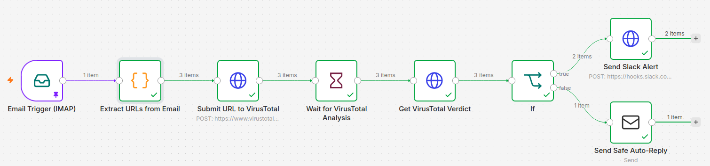
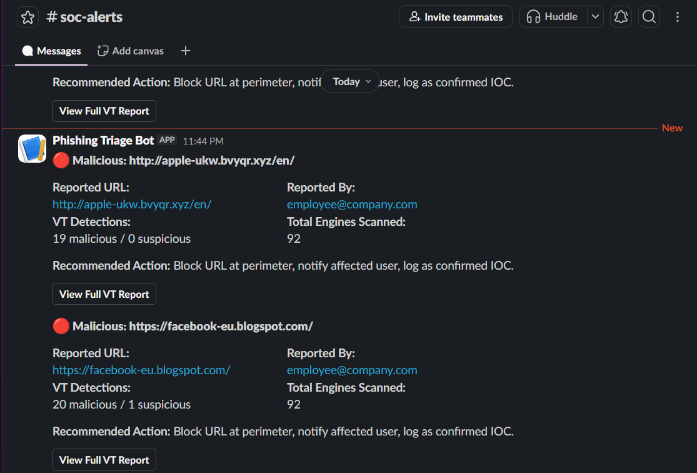
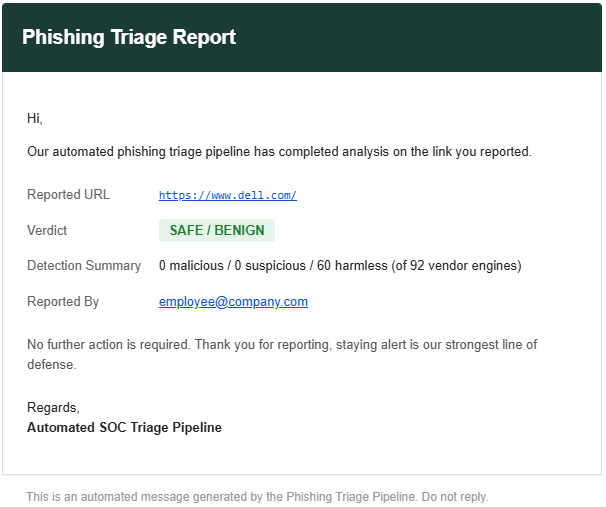
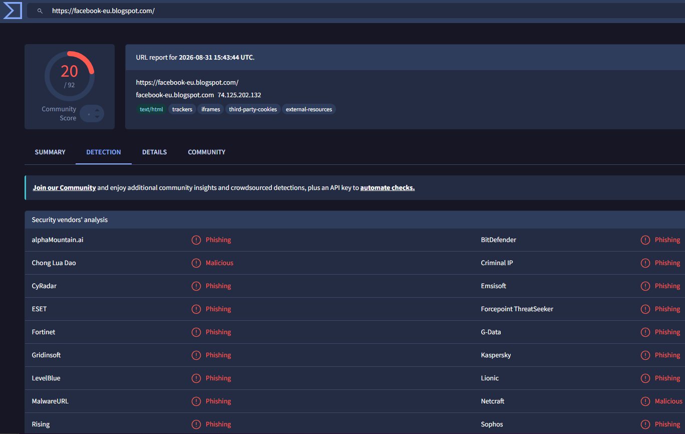

# Phishing Triage Pipeline: SOAR Workflow with Threat Intelligence Enrichment

*SOAR (Security Orchestration, Automation, and Response): software that lets security tools act on a threat automatically, instead of an analyst doing every step by hand.*

**Cut phishing-report verdict time to an average of 38.5 seconds, with 100% detection on real phishing URLs and zero false positives on safe domains.**



**Gmail → Extract URLs → VirusTotal → Decide → Slack Alert / Auto-Reply**

**Jump to:** [Executive Summary](#executive-summary) · [Results](#results) · [Full Technical Breakdown](#full-technical-breakdown) · [References](#references)

---

## Executive Summary

**The problem: phishing is the top breach entry point, and most of the cost is in how slowly it's triaged.**
> Global average breach cost: $4.99M. Phishing-originated breaches take 241 days to contain. ([IBM, 2026](https://www.ibm.com/think/insights/data-matters/cost-of-a-data-breach))
>
> SOC teams handle thousands of alerts a day; over half are false positives. ([Vectra AI](https://www.vectra.ai/topics/alert-fatigue))

**What I built: a SOAR pipeline that triages phishing reports without a human opening one.**
> n8n + Docker. Gmail ingestion → VirusTotal enrichment (90+ vendors) → Slack alert or auto-clearance email. Part of the incident response workflow, not a bolt-on.

**The impact: verdicts in 38.5 seconds, against an industry norm measured in hours.**
> Manual phishing investigations run 3–12 hours at understaffed SOCs. ([The Hacker News, 2026](https://thehackernews.com/2026/03/attackers-dont-just-send-phishing.html))
>
> 10/10 real phishing URLs correctly flagged. 0/10 false positives on safe domains. 20-URL validation set.

**Why it matters at Dell, SLB, and Siemens Energy specifically:**
> Dell's own FY2025 10-K names phishing and credential attacks as an active risk factor. ([SEC filing](https://www.sec.gov/Archives/edgar/data/1571996/000157199625000034/dell-20250131.htm))
>
> SLB frames cyberattacks as a threat to physical OT operations, not just data. ([SLB](https://www.slb.com/insights/cybersecurity-the-next-frontier-of-safety-in-oil-and-gas))
>
> Siemens Energy names phishing as a direct driver of risk across industrial and IIoT systems. ([Siemens Energy](https://www.siemens-energy.com/global/en/home/company/cybersecurity.html))
>
> These three are examples, not the limit: any company with an inbox and a SOC has this exact bottleneck.

---

## Results

**Data sources:** 10 live phishing URLs pulled from [OpenPhish's](https://openphish.com) public feed (active URLs, refreshed every 12 hours, sourced independently, not chosen to flatter the result), plus 10 known-safe enterprise domains selected by hand.

| Metric | Result |
|---|---|
| Malicious URLs correctly detected | 10 / 10 (100%) |
| Safe domains incorrectly flagged | 0 / 10 (0% false positive rate) |
| Average verdict latency | 38.5 seconds |

*Full script and raw output: [`validation/validate_urls.py`](validation/validate_urls.py) · [`validation/validation_results.csv`](validation/validation_results.csv)*

**Malicious verdict, routed to Slack:**



**Safe verdict, routed to automated clearance email:**



**Underlying VirusTotal detection data behind a verdict:**



---

## Full Technical Breakdown

**Tech stack**

| Layer | Tools |
|---|---|
| Orchestration | n8n |
| Deployment | Docker |
| Ingestion | Gmail IMAP |
| Threat intelligence | VirusTotal API v3 |
| Alerting | Slack (Incoming Webhooks, Block Kit formatting) |
| Validation | Python 3 |
| Environment | Ubuntu 24.04 (VMware Workstation) |

**Pipeline flow**

1. **Ingest**: Gmail IMAP watches a dedicated `phishing-reports` label
2. **Extract**: a Code node pulls every URL out of the email body; each URL becomes its own item so a multi-link report is triaged as a batch
3. **Enrich**: each URL is submitted to VirusTotal's `/urls` endpoint, then polled against `/analyses/{id}` after a wait period
4. **Decide**: an If node checks whether any vendor engine flagged the URL malicious
5. **Respond**: malicious routes to a formatted Slack alert (detection count, reporter, direct report link); safe routes to an automated clearance email

**Design decisions**

**Alert a human, don't auto-block.**
> A confirmed-malicious verdict posts to Slack with the URL, reporter, and detection count. The analyst decides remediation. A wrong call here costs one Slack message, not a wrongly-blocked legitimate URL.

**Threshold: `malicious > 0`.**
> One vendor flag escalates, rather than requiring a majority. Correct when the downstream action is "notify a human," not "block traffic."

**Docker over a local install.**
> One image, one command, reproducible on any machine, not tied to one manually-configured VM.

**Bugs hit and resolved**

**VirusTotal scans are async; the pipeline checked results instantly.**
> Verdicts came back empty because the scan wasn't done yet, so every URL defaulted to "safe." Fix: a wait-and-retry step before reading the verdict.

**n8n overwrites item data on every API call, not just returned data.**
> The reported URL and reporter's email vanished by the time the pipeline reached Slack, because each HTTP node replaces the whole item instead of adding to it. Fix: pull that data straight from the node that first created it.

**Run it**

```bash
docker run -d --name n8n -p 5678:5678 -v n8n_data:/home/node/.n8n docker.n8n.io/n8nio/n8n
```
Import [`workflow/`](workflow/) into n8n, configure Gmail IMAP (App Password), VirusTotal API key (Header Auth), and a Slack Incoming Webhook, then create a `phishing-reports` Gmail label to route incoming reports to the trigger.

```bash
python3 validation/validate_urls.py
```
Re-runs the 20-URL validation against live VirusTotal data.

**Limitations**

- Free-tier VirusTotal API (4 req/min, 500/day) would not scale to a real company's report volume without a paid tier
- No deduplication if the same URL is reported multiple times
- No persistent logging/database of past triage decisions, each run is stateless
- Large or slow-scanning domains can occasionally exceed the polling window and time out

---

## References

- IBM Cost of a Data Breach Report 2026: https://www.ibm.com/think/insights/data-matters/cost-of-a-data-breach
- Vectra AI, "What Is Alert Fatigue?": https://www.vectra.ai/topics/alert-fatigue
- The Hacker News, "Attackers Don't Just Send Phishing Emails, They Weaponize Your SOC's Workload": https://thehackernews.com/2026/03/attackers-dont-just-send-phishing.html
- Dell Technologies Inc., Form 10-K FY2025 (SEC filing), cybersecurity risk factors: https://www.sec.gov/Archives/edgar/data/1571996/000157199625000034/dell-20250131.htm
- SLB, "Cybersecurity: The Next Frontier of Safety in Oil and Gas": https://www.slb.com/insights/cybersecurity-the-next-frontier-of-safety-in-oil-and-gas
- Siemens Energy, Cybersecurity: https://www.siemens-energy.com/global/en/home/company/cybersecurity.html
- OpenPhish public phishing feed: https://openphish.com
